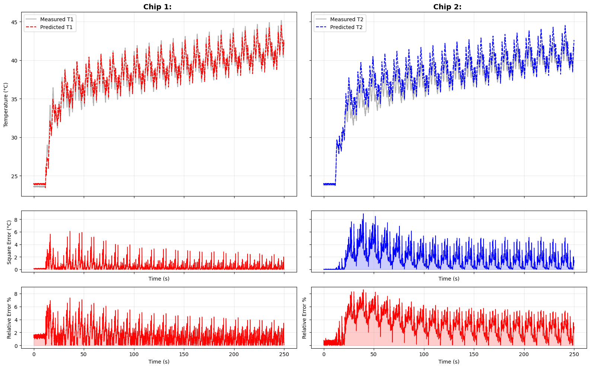

# Thermal Digital Twin for Power Electronics Modules

This repository contains the implementation of a high-fidelity **Thermal Digital Twin (DT)** designed for real-time temperature monitoring and parameter identification of multi-chip power modules. 

The project leverages **Dynamic Mode Decomposition (DMD)** with Hankel delay-embedding to capture complex thermal diffusion dynamics, providing a computationally efficient alternative to traditional Finite Element Method (FEM) simulations.

## 🚀 Key Features

- **Hankel-DMD Modeling**: Utilizes time-shifted snapshot matrices to identify system eigenvalues and modes, effectively capturing "stiff" thermal dynamics (fast chip transients vs. slow heatsink diffusion).
- **Multi-Chip Cross-Heating**: Models thermal coupling between multiple heat sources (IGBTs/Diodes) within a single module.
- **Online Parameter Identification**: Implements a Multi-step Least Squares algorithm to track thermal impedance changes over the module's lifetime.
- **State Estimation**: Integration of Kalman Filters (DEKF/UKF) for real-time state correction and noise rejection.
- **Optimization**: Offline parameter fitting using Particle Swarm Optimization (PSO) for Cauer RC network extraction.

## 🛠 Project Structure

- `sim.ipynb`: Main simulation environment containing the thermal solver, mission profile generators, and DT execution loops.
- `Hankel-dmd.pdf`: Technical documentation and mathematical derivation of the Hankel-DMD approach for temperature diffusion.
- `utils/`: Core utilities for data importing (`Experiment` class) and thermal network definitions.
- `results/`: Exported plots including MSE convergence and relative error analysis.

## 📊 Methodology

### Architecture
The twin approximates the physical module temperatures using  transition matrix derived from DMD, while continuously updating the transition matrices, for more details `Hankel-dmd.pdf`

### Data-Driven Reduced Order Modeling (ROM)
By stacking time-delayed observations into a **Hankel Matrix**, the DMD algorithm can reconstruct the full-state dynamics from limited sensor data.

## 📈 Performance Metrics

The success of the Digital Twin is evaluated based on:
1. **Running Mean Squared Error (MSE)**: Log-scale tracking of model convergence.
2. **Instantaneous Relative Error**: Monitored against a <2% target threshold to ensure accuracy during fast load transients.
## Limitations

The method is purely data driven, as such it is very sensitive to baseline data, and it is not guaranteed to always output physically consistent data.
The biggest limitation is the interpretability of the identified matrices to extract thermal parameters from them, in future work the DMD transition matrices could be used to simulate a simple single step response and curve fit a low order Cauer network for better interpretation.

## 💻 Setup & Usage

### Prerequisites
- Python 3.8+
- NumPy, SciPy, Matplotlib
- Jupyter Lab/Notebook

### Running the Simulation
1. Clone the repository.
2. Ensure your experimental data is placed in the expected directory for the `Experiment` class.
3. Open `sim.ipynb` and execute the cells to initialize the baseline thermal profile and start the Digital Twin tracking.

## Results

## 📚 References

This implementation is based on the following research:
- **Zhang et al. (2017)**: "Online dynamic mode decomposition for time-varying systems"
- **Proctor et al. (2014)**: "Dynamic mode decomposition with control"
- **Kuprat et al. (2024)**: "Thermal Digital Twin of Power Electronics Modules for Online Thermal Parameter Identification."
- **Votava et al. (2024)**: "Multi-step Least Squares Algorithm for Thermal Characterization Based on Mission Profile"

---
**Developed by:** Fernando T
**Focus:** Power Electronics Reliability & Digitalization
Online dynamic mode decomposition for time-varying systems